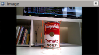
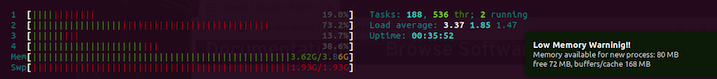
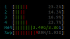

# Deep-Object-Pose---Nvidia-Integration

This repository is a tutorial for embedding a Neural network for object detection through live camera streaming on a Nvidia Jetson nano.
The neural networkd used is the official DOPE ROS package for detection and 6-DoF pose estimation of known objects from an RGB camera. The network has been trained on the following YCB objects: cracker box, sugar box, tomato soup can, mustard bottle, potted meat can, and gelatin box. 

The official repository is available [here](https://github.com/NVlabs/Deep_Object_Pose).


## Requirements
 - A Nvidia Jetson nano with at least 4BG ram
 - Micro-USB power supply 5V - 2A for Nvidia Jetson (I used the official raspberry Pi one)
 - A USB RGB Camera (I used a Kinect Asus Xtion)
 - Download the [official package](https://github.com/NVlabs/Deep_Object_Pose) of deep pose object detection 
 - A desk fan or an Nvidia Jetson compatible one


## Setup
I strongly advise you to start from scratch and flash the Jetson Nano Developer Kit SD Card [Image](https://developer.nvidia.com/embedded/learn/get-started-jetson-nano-devkit#write) on an clean SD card.

Once you flashed the Nvidia Image on the SD card, put it in the Jetson Nano and switch it on. I also advise you to start in the same time the fan for best performance (I will go back to its importance later).

I have tested on Ubuntu 16.04 with ROS Melodic with an NVIDIA Jetson Nano with python 2.7 (and thus pip). The code may work on other systems.


One the Nvidia started, you can follow the repository of [Deep Pose object](https://github.com/NVlabs/Deep_Object_Pose) installation step by step until:

```
$ pip install -r requirements.txt
```

Here you might have some trouble instaling libraries versions with the ones compatibles with the Nvidia Jeton Nano. In this repository, I added a requirement.txt file which contains all versions of the libraries that I was able to install. But in any case, I strongly advise you to install them one by one instead of running the command with the requirements.txt file.

Then you can follow steps 5 and 6 of the Installation process, but remember to replace *kinetic* by *melodic*.


## Running

- **1 Start ROS master**
```
$ cd ~/catkin_ws
$ source devel/setup.bash
$ roscore
```

- **2 Start camera node**
```
$ cd catkin_ws
$ source devel/setup.bash
$ roslaunch openni2_launch openni2.launch
```

- **3 Edit config file**
As I am using a USB camera, you need to edit the config file at ```~/catkin_ws/src/dope/config/config_pose.yaml``` and change the two first lines to:
```
topic_camera: "/camera/rgb/image_raw"
topic_camera_info: "/camera/rgb/camera_info"
```
 All the other parameters are detailled in the Deep Pose Object repository.

- **4 Start DOPE node**
```
$ cd catkin_ws
$ source devel/setup.bash
$ roslaunch openni2_launch openni2.launch
```

- **5 rviz**
One the master, openni and dope nodes are running, you can see the object detected using rviz tool. In my case, I only had the weight soup object uncommented at first in the config file (*weights*: dictionary of object names and there weights path name, **comment out any line to disable detection/estimation of that object**).

```
$ rviz
```

Then select 
1. camera_link 
2. add, by topic 
3. Select dope/image

You will see as follow: 


## Tests

Now that that the DOPE ROS package for detection is set up and running to detect only one object for now, I am going to present here some tests I realized to see how far the Nvidia can performs objects detection using DOPE. The main challenge of this tests is two observe how effecient can be the Nvidia. 

**1. CPU**

This is the main problem to archieve. Because once you started the three ros nodes, the Nvidia has directly slowed down. So I used  ```htop``` to see the CPU, RAM and SWAP memory use.



I looked at it without having rviz running, that may also increase memory consumption depending on the topics you are listenning to. 
As we can see, all RAM **plus** swap memory are used, that might explain why the Nvidia slowed down. 

**2. Temperature**

As I said at the beginning, a fan is required to run the ros nodes on the Nvidia. At first, I started without any fan, and the Nvidia quickly freezed and crashed. With the CLI tool ```$ watch sensors``` (sudo apt-get install lm-sensors), you can see the temperature evolving over the time. 

With a desk Fan, it can maintain the CPU temperature around 24°C. If you do not use one, the temperature can reach 57°C and beyond. I suggest you to keep the temperature as low as possible. I did not get the maximum temperature possible, but the Nvidia tends to freeze around 60°C.

**3. Objects Detected**

The Deep Object Pose Estimation can detect until 7 objects: Cracket, Gelatin, Meat, Mustard, Sugar, Soup and Bleach. As I said, the object detection can be able/disable from the config file with the weights dictionnary. I started with the soup, then I uncommented the mustard. After a while, the Nvidia crashed. I re started with only one object, then stop the dope nope, edit the config file and uncomment a second object and re start the dope node.

I did it couples times to test, and it seems that the Nvidia cannot support two objects detection for more than 20/30 seconds before crashing.

**4. Edit config file**

If you look at the config file parameters, there is the ```downscale_height```: If the input image is larger than this, scale it down to this pixel height. Very large input images eat up all the GPU memory and slow down inference. Also, DOPE works best when the object size (in pixels) has appeared in the training data (which is downscaled to 400 px). For these reasons, downscaling large input images to something reasonable (e.g., 400-500 px) improves memory consumption, inference speed and recognition results.

By default, this value is set to 500px, I change it to 400 and then to 300px. And what we can see, it divides by two the SWAP memory use thus increase performance.



NOTE: With 300px, the Nvidia can perform two objects detection without crashing.
